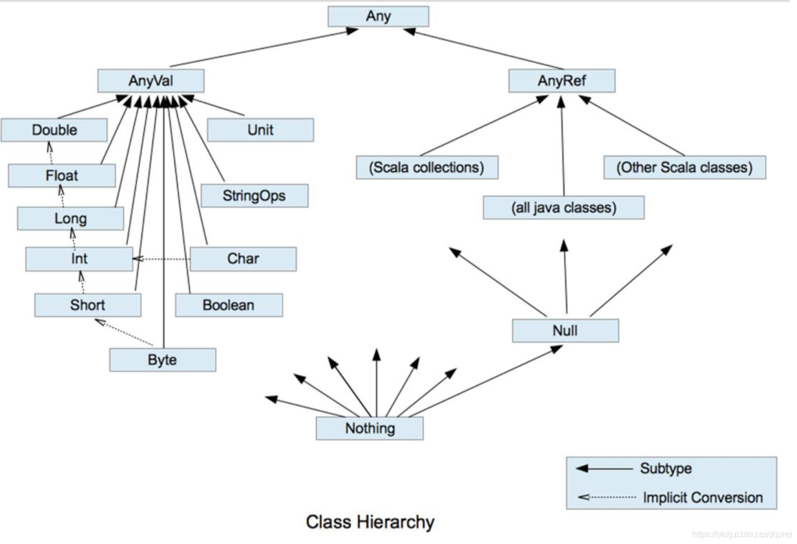

### 关联Scala源码
1. https://www.scala-lang.org/download/ 下载scala-sources-CurrentVersionNumber.tar.gz
2. 解压scala-sources-CurrentVersionNumber.tar.gz-->scala-sources-CurrentVersionNumber
3. Ctrl + 鼠标 ===> Attach Source ==> 选择scala-sources-CurrentVersionNumber文件夹

### Scale数据类型

1. Scala中一切数据都是对象,都是Any的子类
2. Scala中数据类型分为两大类:数值类型(AnyVal)、引用类型(AnyRef),不管是值类型还是引用类型都是对象
3. Scala特殊的类型之Null,只有一个实例就是null,它是所有引用类型(AnyRef)的子类
4. Scala特殊类型之Nothing,是其他任意类型的子类