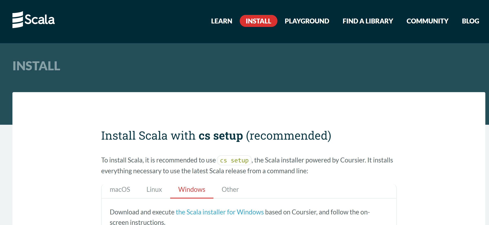
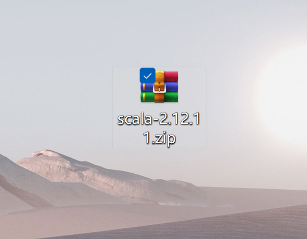
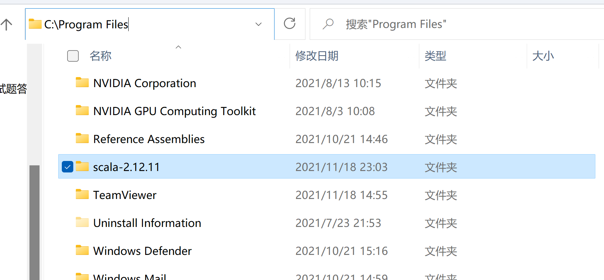
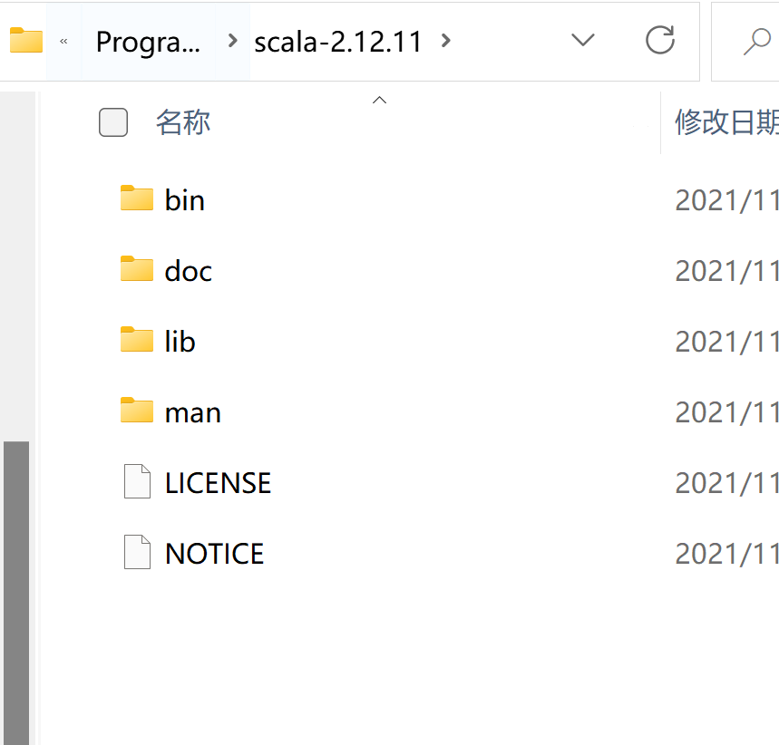
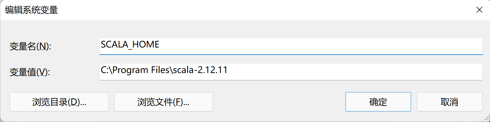
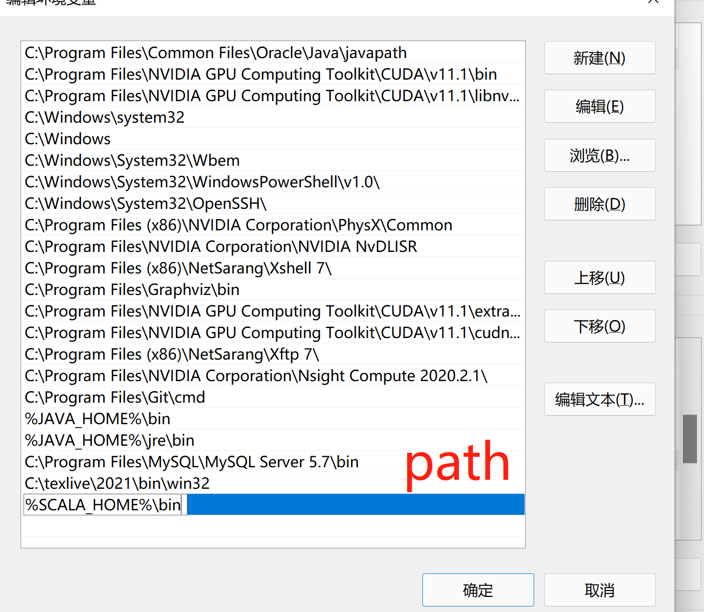
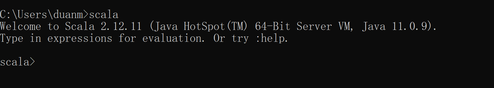
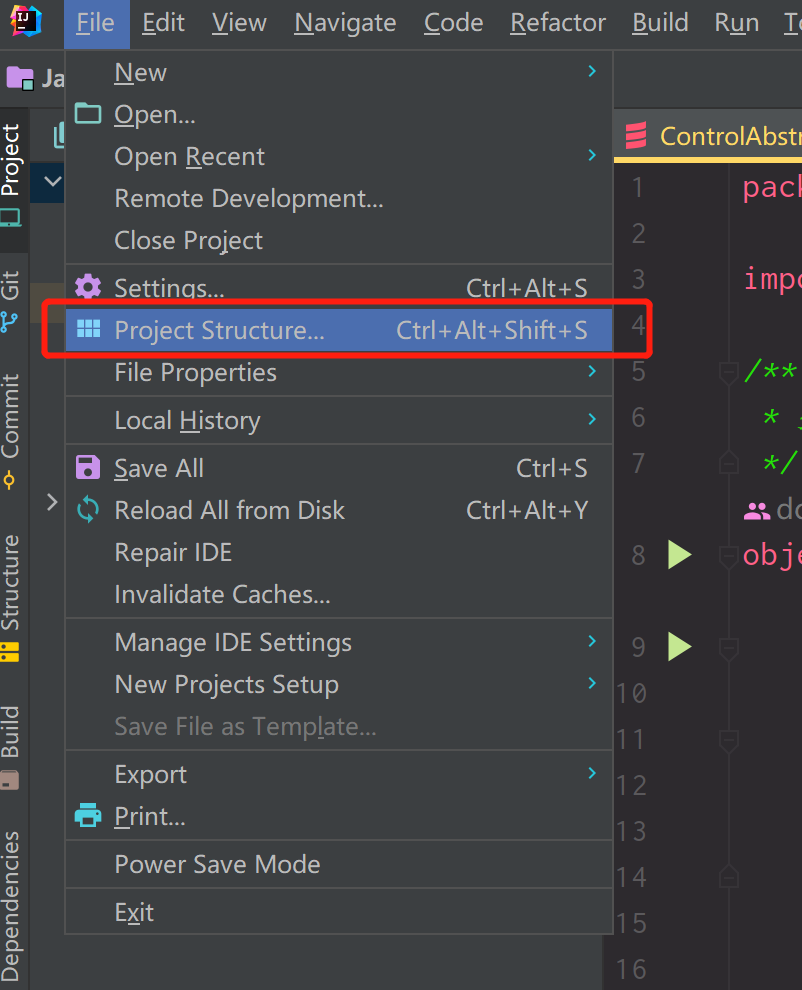
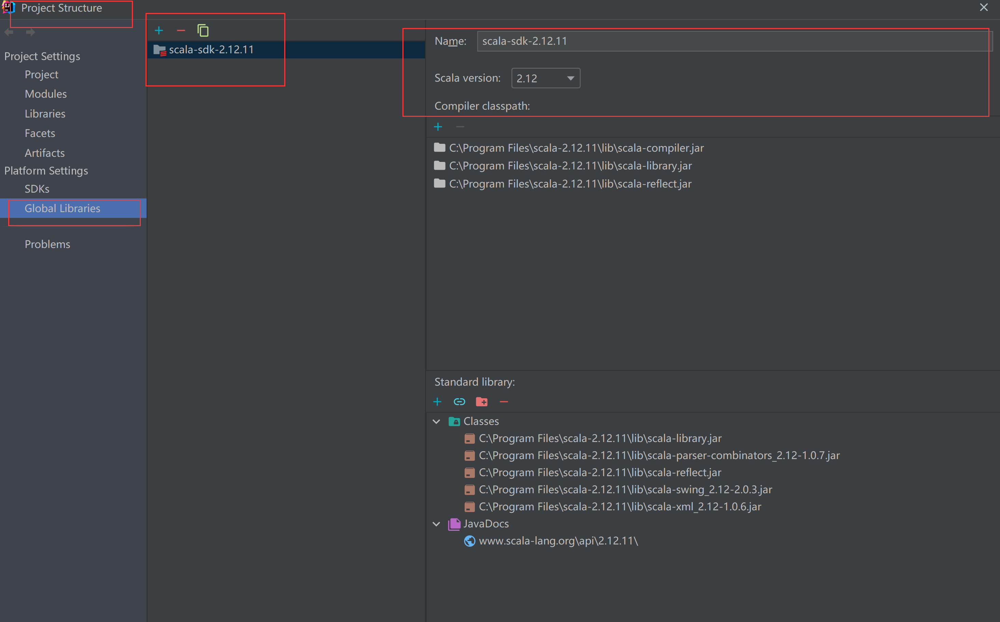
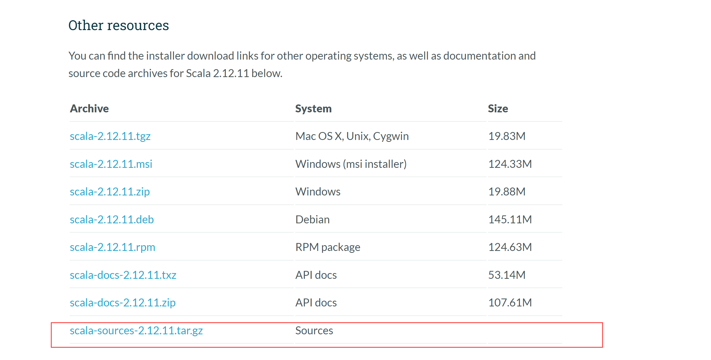

### Scala环境变量配置

1. 下载Scala(官网下载地址:https://www.scala-lang.org/download/)

     
    
     

2. Scala下载文件解压缩(bin目录在文件夹的第一层)

   
    
   

3. 配置环境变量

   
    
   

4. 测试

   

### IDEA添加Scala支持

1. 下载插件

    

2. 添加Scala支持

    
     
    

### 关联Scala源码

1. https://www.scala-lang.org/download/ 下载源码(与Scala版本一致)

    

2. 解压缩

3. Ctrl + 鼠标 ===> Attach Source ==> 选择解压缩的文件夹

    

